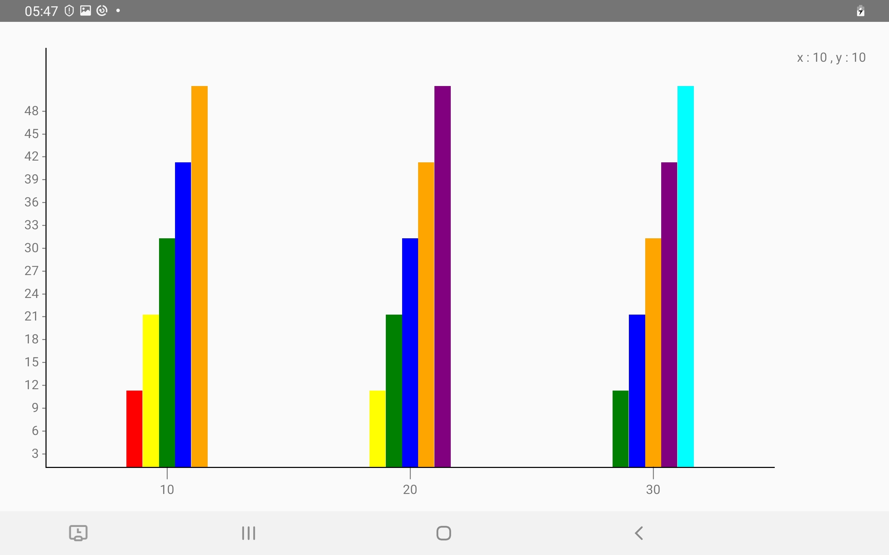
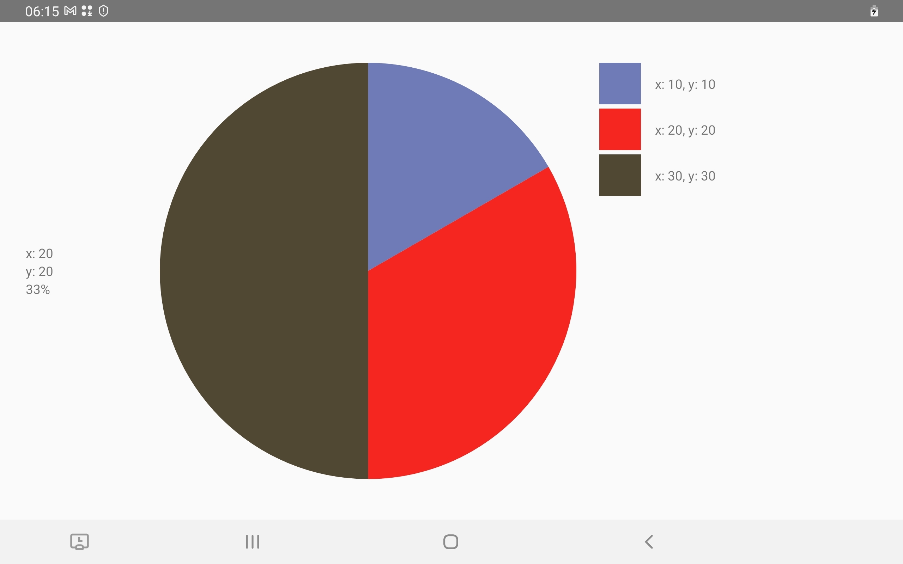
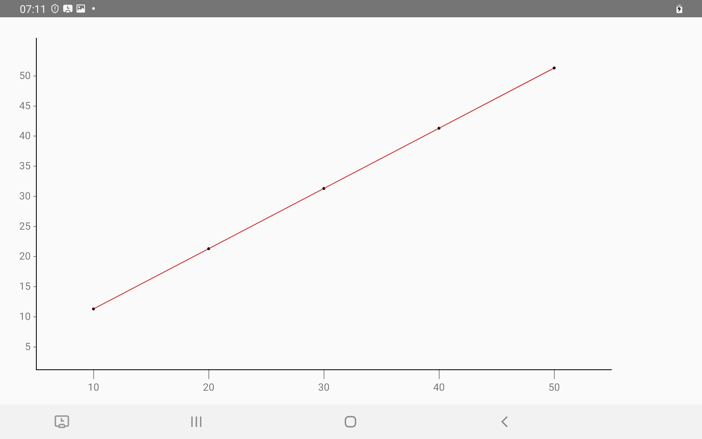

# react-native-build-charts

## Getting started

`$ npm install react-native-build-charts --save`

### Mostly automatic installation

`$ react-native link react-native-build-charts`

### Manual installation


#### iOS

1. In XCode, in the project navigator, right click `Libraries` ➜ `Add Files to [your project's name]`
2. Go to `node_modules` ➜ `react-native-build-charts` and add `RNReactNativeBuildCharts.xcodeproj`
3. In XCode, in the project navigator, select your project. Add `libRNReactNativeBuildCharts.a` to your project's `Build Phases` ➜ `Link Binary With Libraries`
4. Run your project (`Cmd+R`)<

#### Android

1. Open up `android/app/src/main/java/[...]/MainActivity.java`
  - Add `import com.reactlibrary.RNReactNativeBuildChartsPackage;` to the imports at the top of the file
  - Add `new RNReactNativeBuildChartsPackage()` to the list returned by the `getPackages()` method
2. Append the following lines to `android/settings.gradle`:
  	```
  	include 'react-native-build-charts'
  	project('react-native-build-charts').projectDir = new File(rootProject.projectDir, 	'../node_modules/react-native-build-charts/android')
  	```
3. Insert the following lines inside the dependencies block in `android/app/build.gradle`:
  	```
      compile project(':react-native-build-charts')
  	```

#### Windows
[Read it! :D](https://github.com/ReactWindows/react-native)

1. In Visual Studio add the `RNReactNativeBuildCharts.sln` in `node_modules/react-native-build-charts/windows/RNReactNativeBuildCharts.sln` folder to their solution, reference from their app.
2. Open up your `MainPage.cs` app
  - Add `using React.Native.Build.Charts.RNReactNativeBuildCharts;` to the usings at the top of the file
  - Add `new RNReactNativeBuildChartsPackage()` to the `List<IReactPackage>` returned by the `Packages` method


## Usage

## Creating a Bar chart
```javascript
import {BarChart} from 'react-native-build-charts';

<BarChart width={1000} height={600} data={[
      {
        x: 10,
        y: [10,20,30,40,50]
      },
      {
        x: 20,
        y: [10,20,30,40,50]
      },
      {
        x: 30,
        y: [10,20,30,40,50]
      }
    ]} range={3}/>
```

| Props | Data Type | Description |
| ------ | -----    |  - |
|   width     | number      |  The width of the chart             |
|   height     | number       | The height of the chart           |
|    range (optional)    | number   | The range of the y-axis |
| data | { x: any, y : Number[] }   | The data of the chart |





## Creating a Pie chart

```javascript
import { PieChart } from 'react-native-build-charts';

<PieChart size={450} data={[
      {
        x: 10,
        y: 10
      },
      {
        x: 20, 
        y: 20
      },
      {
        x: 30,
        y: 30
      }
    ]}/>
```

| Props | Data Type | Description |
| ------ | -----    |  - |
|   size     | number      |  The size of the chart             |
| data | { x: any, y : Number }   | The data of the chart |



## Creating a Line chart

```javascript
import { LineChart } from 'react-native-build-charts';

<LineChart width={1000} height={575} data={
      [
        {
        x:10,
        y:10
        },
        {
          x: 20,
          y: 20
        },
        {
          x: 30,
          y:30
        },
        {
          x: 40,
          y: 40
        },
        {
          x: 50,
          y: 50
        }
      ]
    }/>
```

| Props | Data Type | Description |
| ------ | -----    |  - |
|   width     | number      |  The width of the chart             |
|   height     | number       | The height of the chart           |
|    range (optional)    | number   | The range of the y-axis |
| data | { x: any, y : number }   | The data of the chart |
| color | string| The color of the line |

